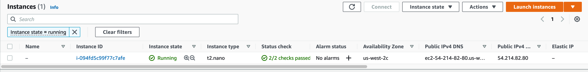

# Solution

Create the file named `main.tf`.

```
$ touch main.tf
```

Edit the file and register the AWS provider.

```
terraform {
  required_providers {
    aws = {
      source  = "hashicorp/aws"
      version = "4.16.0"
    }
  }
}
```

Define the provider in the region `us-west-2`. Make sure to use the same name as the registered provider.

```
provider "aws" {
  region = "us-west-2"
}
```

Add the EC2 instance to the configuration with the relevant attribute values.

```
resource "aws_instance" "app_server" {
  ami           = "ami-077ee47512dc6f3ca"
  instance_type = "t2.nano"
}
```

For testing purposes, set the environment variables for the current shell that define the AWS credentials.

```
$ export AWS_ACCESS_KEY_ID=<access-key-id>
$ export AWS_SECRET_ACCESS_KEY=<secret-access-key>
```

Initialize the project using the `init` command.

```
$ terraform init

Initializing the backend...

Initializing provider plugins...
- Finding hashicorp/aws versions matching "4.16.0"...
- Installing hashicorp/aws v4.16.0...
- Installed hashicorp/aws v4.16.0 (signed by HashiCorp)

Terraform has created a lock file .terraform.lock.hcl to record the provider
selections it made above. Include this file in your version control repository
so that Terraform can guarantee to make the same selections by default when
you run "terraform init" in the future.

Terraform has been successfully initialized!

You may now begin working with Terraform. Try running "terraform plan" to see
any changes that are required for your infrastructure. All Terraform commands
should now work.

If you ever set or change modules or backend configuration for Terraform,
rerun this command to reinitialize your working directory. If you forget, other
commands will detect it and remind you to do so if necessary.
```

Execute the `plan` command to see the changes that can be applied.

```
$ terraform plan

Terraform used the selected providers to generate the following execution plan. Resource actions are indicated with the
following symbols:
  + create

Terraform will perform the following actions:

  # aws_instance.app_server will be created
  + resource "aws_instance" "app_server" {
...
```

The `apply` command will make the changes on AWS.

```
$ terraform apply

Terraform used the selected providers to generate the following execution plan. Resource actions are indicated with the
following symbols:
  + create

Terraform will perform the following actions:

  # aws_instance.app_server will be created
  + resource "aws_instance" "app_server" {
...
```

You should be able to find the provisioned EC2 instance in the AWS dashboard.



Define the provider in the region `us-east-2`. Make sure to use the same name as the registered provider.

```
provider "aws" {
  region = "us-east-2"
  alias = "east"
}

resource "aws_instance" "app_server" {
  ami           = "ami-077ee47512dc6f3ca"
  instance_type = "t2.nano"
  provider = aws.east
}
```

The change cannot be applied as the AMI image ID does not exist in the `us-east-2` region.

```
$ terraform apply
...

Plan: 1 to add, 0 to change, 0 to destroy.

Do you want to perform these actions?
  Terraform will perform the actions described above.
  Only 'yes' will be accepted to approve.

  Enter a value: yes

aws_instance.app_server: Creating...
╷
│ Error: creating EC2 Instance: InvalidAMIID.NotFound: The image id '[ami-077ee47512dc6f3ca]' does not exist
│ 	status code: 400, request id: 3302c572-45c5-4688-9c4f-13ddceae9928
│
│   with aws_instance.app_server,
│   on main.tf line 19, in resource "aws_instance" "app_server":
│   19: resource "aws_instance" "app_server" {
│
╵
```

Comment out the `provider` argument for the resource. Delete the existing EC2 instance with the `destroy` command.

```
$ terraform destroy
...

Plan: 0 to add, 0 to change, 1 to destroy.

Do you really want to destroy all resources?
  Terraform will destroy all your managed infrastructure, as shown above.
  There is no undo. Only 'yes' will be accepted to confirm.

  Enter a value: yes

aws_instance.app_server: Destroying... [id=i-0e11c52ef4a55367f]
aws_instance.app_server: Still destroying... [id=i-0e11c52ef4a55367f, 10s elapsed]
aws_instance.app_server: Still destroying... [id=i-0e11c52ef4a55367f, 20s elapsed]
aws_instance.app_server: Destruction complete after 30s
```